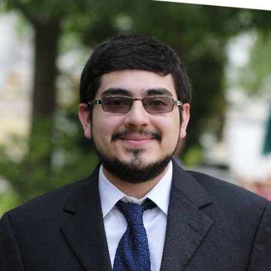

I am currently a post-graduate clinical fellow in Gastroenterology at the Columbia University Irving Medical Center (CUIMC), where I am enrolled in the Master’s of Science in Patient Oriented Research program for clinicians through the Columbia Mailman School of Public Health and a trainee in the lab of Dr. Julian Abrams. I investigate how the human microbiome is altered in pathologic states to better understand the role it may play in the pathophysiology of disease to identify possible targets for new therapeutics. I will be working on translational studies of Barrett’s esophagus (a pre-cancerous lesion) and Esophageal Adenocarcinoma to study alterations in the oral and esophageal microbial community structure, and metabolite expression.  

I first became interested in the field of the microbiome as an undergraduate at Harvard College when I first worked in the laboratory of Dr. Peter Turnbaugh, PhD in the department of Systems Biology. The lab studied the interrelationships among diet shifts, host genetics, and the gut microbiome utilizing mouse models. There I learned how to process stool samples for DNA extraction and submission for sequencing, initial genomic analyses, and establishing and cultivating mouse models for our dietary studies. We also collaborated with the lab of Dr. Lee Kaplan to investigate the role of bypass surgery on the microbiome, demonstrating how it alters it in mouse models. This work led to several co-authorship publications, conference poster presentations and my honors senior thesis. 

As a medical student I transitioned from mouse models to studies based on human subjects in the laboratory of Dr. Douglas Kwon, MD, PhD, an infectious disease clinical specializing in the fields of immunology and microbiology at the Ragon Institute of MGH, Harvard and MIT. Our work studied the gut as a mucosal barrier, and HIV-specific responses in the enteric microbiome. My work was awarded support from the Doris Duke Foundation, and this led to several co-authorship publications, poster and oral abstracts, and a medical school honors thesis. This led to my clinical interest of gastroenterology, and the pursuit of research in my medical residency utilizing the microbiome as a lens into human disease processes. I sought mentorship from several faculty members, work with Dr. Patricia Bloom, MD in the lab of Dr. Raymond Chung, MD as well as Dr. David Drew, PhD in the the lab of Dr. Andrew Chan, MD.  This led to studies of both cirrhosis and colorectal cancer and how we can associate changes in the microbiome, and in the latter the metagenome, to worse clinical outcomes. I also sought development programs, and applied for and was awarded a medical resident clinical research award for my work into metagenomic changes and aspirin use for the chemo-prevention of colorectal cancer. 

For my current stage of training, I am currently completing my Gastroenterology Fellowship, and have enrolled in a clinician master’s program to supplement the research I am currently conducting. Clinically, I am exposed to the many fields within Gastroenterology, and have met many clinical mentors, as well as having selected my research mentor Dr. Julian Abrams (PI of the parent award and Barrett’s esophagus expert). In addition, as I hope to build upon the computational skills I began to accrue over my various stages of training, he has put me in touch with Dr. Tal Korem, PhD, a computational scientist with whom he has successfully collaborated and co-mentored trainees in the past. I also am currently receiving formal education in biostatistics, epidemiology, and biological applications of computer science through the Masters of Science Program for Patient Oriented Research where I take classes each semester. I am uniquely positioned by the wealth of resources at this institution to develop myself as a clinical investigator, and to learn from those who have managed to become NIH-funded investigators. I aim to improve my skills in study design, computational analysis, and microbiome work by delving into metabolic studies during my fellowship to prepare me for the next steps when I will apply for career development awards as I continue my early career. 
